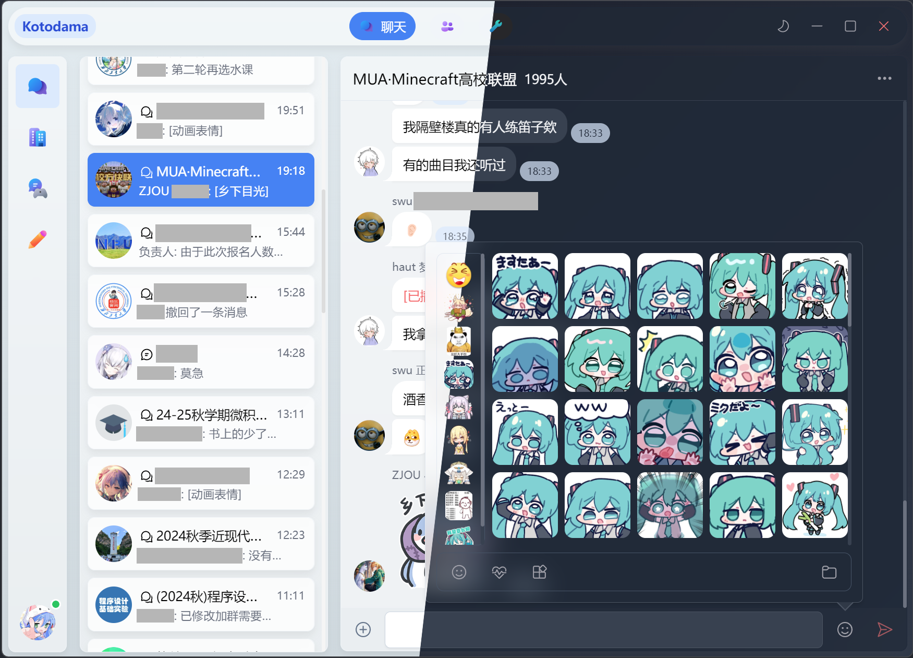

<div id="top"></div>

<!-- 项目 LOGO -->
<br />
<div align="center">
  <a href="https://github.com/nullsora/kotodama">
    
  </a>

<h3 align="center">Kotodama</h3>

[![Contributors][contributors-shield]][contributors-url]
[![Forks][forks-shield]][forks-url]
[![Stargazers][stars-shield]][stars-url]
[![Issues][issues-shield]][issues-url]
[![AGPL-3.0 License][license-shield]][license-url]

  <p align="center">
    好看的 (?) 第三方Onebot客户端实现
    <br />
    <a href="https://github.com/nullsora/kotodama"><strong>浏览文档 »</strong></a>
    <br />
    <br />
    <a href="https://github.com/nullsora/kotodama">查看 Demo</a>
    ·
    <a href="https://github.com/nullsora/kotodama/issues">反馈 Bug</a>
    ·
    <a href="https://github.com/nullsora/kotodama/issues">请求新功能</a>
  </p>
</div>

<!-- 目录 -->
<details>
  <summary>目录</summary>
  <ol>
    <li>
      <a href="#关于本项目">关于本项目</a>
      <ul>
        <li><a href="#构建工具">构建工具</a></li>
      </ul>
    </li>
    <li>
      <a href="#开始">开始</a>
      <ul>
        <li><a href="#依赖">依赖</a></li>
        <li><a href="#安装">安装</a></li>
        <li><a href="#构建">构建</a></li>
      </ul>
    </li>
    <li><a href="#使用方法">使用方法</a></li>
    <li><a href="#特性支持">特性支持</a></li>
    <li><a href="#贡献">贡献</a></li>
    <li><a href="#许可证">许可证</a></li>
    <li><a href="#致谢">致谢</a></li>
  </ol>
</details>

<!-- 关于本项目 -->

## 关于本项目

Kotodama 是一个基于 Onebot 标准的第三方客户端实现。



> [!IMPORTANT]
> 本项目目前仍在开发中，部分功能可能尚未完善或不可用。

<p align="right">(<a href="#top">回到顶部</a>)</p>

### 构建工具

- [Electron](https://www.electronjs.org/)
- [Electron-Vite](https://electron-vite.org/)
- [TypeScript](https://www.typescriptlang.org/)
- [Vue.js](https://vuejs.org/)
- [PrimeVue](https://primevue.org/)
- [UnoCSS](https://unocss.dev/)

<p align="right">(<a href="#top">回到顶部</a>)</p>

<!-- 开始 -->

## 开始

如果你并非开发者，你可以直接下载最新的版本并且运行。

[][release-url]

这是一份在本地构建项目的指导的例子。
要获取本地副本并且配置运行，你可以按照下面的示例步骤操作。

### 依赖

- 安装pnpm _(可选)_
  ```sh
  npm install pnpm@latest -g
  ```

### 安装

1. 克隆本仓库
   ```sh
   git clone https://github.com/nullsora/kotodama.git
   ```
2. 安装依赖
   ```sh
    pnpm install
   ```
3. 进行开发
   ```sh
   pnpm dev
   ```

### 构建项目

- 构建icon

  ```sh
  pnpm build:icon
  ```

  只需要在第一次构建时运行一次，之后不需要再运行。

- 选择你的平台进行打包

  ```sh
  pnpm build:unpack
  pnpm build:win
  pnpm build:linux
  pnpm build:mac
  ```

- 你可以在 `dist` 文件夹中找到构建好的文件

<p align="right">(<a href="#top">返回顶部</a>)</p>

<!-- 使用方法 示例 -->

## 使用方法

- 在使用之前，你需要有一个可用的Onebot后端。因为使用了一些非Onebot标准的API，所以对[NapCat](https://github.com/NapNeko/NapCatQQ)或[LLOnebot](https://github.com/LLOneBot/LLOneBot)的支持是最好的。

  同时，你需要在Onebot后端中启用ws正向连接。

> [!WARNING]
> 使用最新 (9.9.16.x) 版本的 QQ 配合 LiteloaderQQNT 出现了[强制下线现象](https://github.com/LiteLoaderQQNT/LiteLoaderQQNT/issues/1032)，谨慎升级QQ。

- 打开软件，输入Onebot服务器地址和token (如果存在), 点击连接

<p align="right">(<a href="#top">返回顶部</a>)</p>

<!-- 特性支持 -->

## 特性支持

- 🍬 特性
  - [x] 聊天分组 (为了这碟醋才包的饺子)
  - [x] 本地表情 (很好啊)
  - [x] 多图展示 (想关自己关)
- [ ] 基础功能
  - [x] 连接 Onebot 服务器
  - [ ] 聊天功能
    - [x] 置顶聊天
    - [ ] 联系人管理，群管理等
  - [x] 消息展示
    - [x] 文本
    - [x] QQ表情
    - [x] 图片
    - [x] 动画表情
    - [x] 语音
    - [x] 视频
    - [x] @某人
    - [x] 猜拳
    - [x] 骰子
    - [ ] ~~戳一戳~~
    - [ ] ~~分享链接~~
    - [x] 分享联系人 (支持json格式的分享)
    - [x] 分享位置 (支持json格式的分享)
    - [x] 引用/回复
    - [x] 聊天记录
    - [ ] ~~XML消息~~ (NTQQ也不用啊)
    - [x] JSON消息
    - [x] 文件
    - [x] Markdown
  - [ ] 消息发送
    - [x] 文本
    - [x] QQ表情
    - [x] 图片
    - [x] 动画表情 (你收藏的那些)
    - [ ] 语音 (你真的有电脑上发语音的需求吗)
    - [x] 视频
    - [x] @某人
    - [x] 猜拳
    - [x] 骰子
    - [ ] ~~戳一戳~~
    - [ ] ~~分享链接~~
    - [ ] 分享联系人
    - [ ] 分享位置
    - [x] 引用/回复
    - [ ] 聊天记录
    - [ ] ~~XML消息~~
    - [ ] ~~JSON消息~~
    - [x] 文件
- [x] 个性化
  - [x] Light / Dark Mode 切换
  - [x] 自定义主题色 / 背景

到 [open issues](https://github.com/nullsora/kotodama/issues) 页查看所有请求的功能 （以及已知的问题）。

<p align="right">(<a href="#top">回到顶部</a>)</p>

<!-- 贡献 -->

## 贡献

贡献让开源社区成为了一个非常适合学习、互相激励和创新的地方。你所做出的任何贡献都是**受人尊敬**的。

如果你有好的建议，请复刻（fork）本仓库并且创建一个拉取请求（pull request）。你也可以简单地创建一个议题（issue），并且添加标签「enhancement」。不要忘记给项目点一个 star！再次感谢！

1. 复刻（Fork）本项目
2. 创建你的 Feature 分支 (`git checkout -b feature/AmazingFeature`)
3. 提交你的变更 (`git commit -m 'Add some AmazingFeature'`)
4. 推送到该分支 (`git push origin feature/AmazingFeature`)
5. 创建一个拉取请求（Pull Request）

<p align="right">(<a href="#top">回到顶部</a>)</p>

<!-- 许可证 -->

## 许可证

根据 AGPL-3.0 许可证分发。打开 [LICENSE](LICENSE) 查看更多内容。

<p align="right">(<a href="#top">回到顶部</a>)</p>

<!-- 致谢 -->

## 致谢

- @柴油动力轮椅 - 为本项目绘制了图标
- [Animista](https://animista.net/) - 提供了部分动画效果
- [霞鹜文楷](https://github.com/lxgw/LxgwWenKai)
- [Vite](https://vitejs.dev/)
- [Pinia](https://pinia.vuejs.org/)
- [unocss-preset-scrollbar](https://github.com/unocss-community/unocss-preset-scrollbar)
- [VueDraggablePlus](https://vue-draggable-plus.pages.dev/)
- [markdown-it](https://markdown-it.github.io/markdown-it/)

<p align="right">(<a href="#top">返回顶部</a>)</p>

<!-- MARKDOWN 链接 & 图片 -->
<!-- https://www.markdownguide.org/basic-syntax/#reference-style-links -->

[contributors-shield]: https://img.shields.io/github/contributors/nullsora/kotodama.svg?style=for-the-badge
[contributors-url]: https://github.com/nullsora/kotodama/graphs/contributors
[forks-shield]: https://img.shields.io/github/forks/nullsora/kotodama.svg?style=for-the-badge
[forks-url]: https://github.com/nullsora/kotodama/network/members
[stars-shield]: https://img.shields.io/github/stars/nullsora/kotodama.svg?style=for-the-badge
[stars-url]: https://github.com/nullsora/kotodama/stargazers
[issues-shield]: https://img.shields.io/github/issues/nullsora/kotodama.svg?style=for-the-badge
[issues-url]: https://github.com/nullsora/kotodama/issues
[license-shield]: https://img.shields.io/github/license/nullsora/kotodama.svg?style=for-the-badge
[license-url]: https://github.com/nullsora/kotodama/blob/main/LICENSE
[release-url]: https://github.com/nullsora/kotodama/releases/latest

