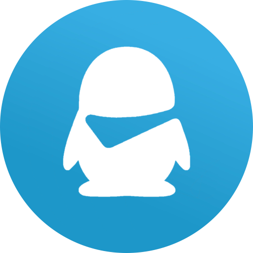

<div id="top"></div>

[![Contributors][contributors-shield]][contributors-url]
[![Forks][forks-shield]][forks-url]
[![Stargazers][stars-shield]][stars-url]
[![Issues][issues-shield]][issues-url]
[![AGPL-3.0 License][license-shield]][license-url]


<!-- 项目 LOGO -->
<br />
<div align="center">
  <a href="https://github.com/nullsora/kotodama">
    
  </a>

<h3 align="center">Kotodama</h3>

  <p align="center">
    好看的 (?) 第三方Onebot客户端实现
    <br />
    <a href="https://github.com/nullsora/kotodama"><strong>浏览文档 »</strong></a>
    <br />
    <br />
    <a href="https://github.com/nullsora/kotodama">查看 Demo</a>
    ·
    <a href="https://github.com/nullsora/kotodama/issues">反馈 Bug</a>
    ·
    <a href="https://github.com/nullsora/kotodama/issues">请求新功能</a>
  </p>
</div>


<!-- 目录 -->
<details>
  <summary>目录</summary>
  <ol>
    <li>
      <a href="#关于本项目">关于本项目</a>
      <ul>
        <li><a href="#构建工具">构建工具</a></li>
      </ul>
    </li>
    <li>
      <a href="#开始">开始</a>
      <ul>
        <li><a href="#依赖">依赖</a></li>
        <li><a href="#安装">安装</a></li>
      </ul>
    </li>
    <li><a href="#使用方法">使用方法</a></li>
    <li><a href="#特性支持">特性支持</a></li>
    <li><a href="#贡献">贡献</a></li>
    <li><a href="#许可证">许可证</a></li>
  </ol>
</details>


<!-- 关于本项目 -->
## 关于本项目

[![产品截图][product-screenshot]](https://example.com)

Kotodama 是一个基于 Onebot 标准的第三方客户端实现。同样也是本人心中 IM 客户端应该有的形态。

<p align="right">(<a href="#top">回到顶部</a>)</p>


### 构建工具

* [Node.js](https://nodejs.org/)
* [pnpm](https://pnpm.io/)

<p align="right">(<a href="#top">回到顶部</a>)</p>


<!-- 开始 -->
## 开始

这是一份在本地构建项目的指导的例子。
要获取本地副本并且配置运行，你可以按照下面的示例步骤操作。

### 依赖

这只是一个列出软件依赖和安装方法的例子。
* pnpm
  ```sh
  npm install pnpm@latest -g
  ```

### 安装

_下面是一个指导你的受众如何安装和配置你的应用的例子。这个模板不需要任何外部依赖或服务。_

1. 克隆本仓库
   ```sh
   git clone https://github.com/nullsora/kotodama.git
   ```
2. 安装依赖
   ```sh
    pnpm install
    ```
3. 进行开发
    ```sh
    pnpm dev
    ```

<p align="right">(<a href="#top">返回顶部</a>)</p>


<!-- 使用方法 示例 -->
## 使用方法

选择你的平台进行项目构建
  ```sh
  pnpm build:unpack
  pnpm build:win
  pnpm build:linux
  pnpm build:mac
  ```

<p align="right">(<a href="#top">返回顶部</a>)</p>


<!-- 特性支持 -->
## 特性支持

- [ ] 基础功能
    - [*] 连接 Onebot 服务器
    - [ ] 消息接收和展示 (部分支持)
    - [ ] 消息发送 (仅支持文字)
    - [ ] 联系人管理，群管理等
- [*] 个性化
    - [*] Light / Dark Mode 切换
    - [*] 自定义主题色 / 背景

到 [open issues](https://github.com/nullsora/kotodama/issues) 页查看所有请求的功能 （以及已知的问题）。

<p align="right">(<a href="#top">回到顶部</a>)</p>


<!-- 贡献 -->
## 贡献

贡献让开源社区成为了一个非常适合学习、互相激励和创新的地方。你所做出的任何贡献都是**受人尊敬**的。

如果你有好的建议，请复刻（fork）本仓库并且创建一个拉取请求（pull request）。你也可以简单地创建一个议题（issue），并且添加标签「enhancement」。不要忘记给项目点一个 star！再次感谢！

1. 复刻（Fork）本项目
2. 创建你的 Feature 分支 (`git checkout -b feature/AmazingFeature`)
3. 提交你的变更 (`git commit -m 'Add some AmazingFeature'`)
4. 推送到该分支 (`git push origin feature/AmazingFeature`)
5. 创建一个拉取请求（Pull Request）

<p align="right">(<a href="#top">回到顶部</a>)</p>


<!-- 许可证 -->
## 许可证

根据 AGPL-3.0 许可证分发。打开 [LICENSE](LICENSE) 查看更多内容。

<p align="right">(<a href="#top">回到顶部</a>)</p>


<!-- MARKDOWN 链接 & 图片 -->
<!-- https://www.markdownguide.org/basic-syntax/#reference-style-links -->
[contributors-shield]: https://img.shields.io/github/contributors/nullsora/kotodama.svg?style=for-the-badge
[contributors-url]: https://github.com/nullsora/kotodama/graphs/contributors
[forks-shield]: https://img.shields.io/github/forks/nullsora/kotodama.svg?style=for-the-badge
[forks-url]: https://github.com/nullsora/kotodama/network/members
[stars-shield]: https://img.shields.io/github/stars/nullsora/kotodama.svg?style=for-the-badge
[stars-url]: https://github.com/nullsora/kotodama/stargazers
[issues-shield]: https://img.shields.io/github/issues/nullsora/kotodama.svg?style=for-the-badge
[issues-url]: https://github.com/nullsora/kotodama/issues
[license-shield]: https://img.shields.io/github/license/nullsora/kotodama.svg?style=for-the-badge
[license-url]: https://github.com/nullsora/kotodama/blob/master/LICENSE.txt
[product-screenshot]: images/screenshot.png